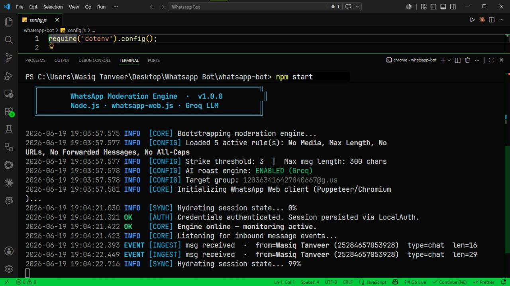

<div align="center">



# 🤖 WhatsApp AI Moderator

### A savage, AI-powered moderation bot that runs your WhatsApp group so you don't have to.

It watches every message, enforces your rules, roasts the rule-breakers with AI, and obeys only **the big boss**. 👑

<p>
  
  
  
  
</p>

</div>

---

## ✨ Why this exists

Managing a WhatsApp group with 30+ members sounds easy until you're the one responsible for it. Spam links, forwarded chains, walls of ALL CAPS, random media floods — and someone always finds a way to break the rules.

So instead of moderating manually at 3 AM, I built a bot that does it automatically, consistently, and with a little bit of attitude.

---

## 🚀 Features

### 🛡️ Smart Moderation Engine
- 🚫 **Blocks links** (http / https / www)
- 🖼️ **Blocks all media** — images, videos, stickers, GIFs, voice notes, documents
- ✍️ **300-character limit** on text messages
- 📨 **Blocks forwarded messages**
- 🔊 **Blocks ALL-CAPS spam**
- 🧩 **Pluggable rule system** — add a new rule in ~2 minutes

### ⚖️ Progressive Discipline
- Strike system with auto-warnings
- **3 strikes → automatic removal** from the group
- Admins & the group owner are always exempt

### 🎫 Permission Passes
- Grant a member a temporary bypass: `allow @user`
- **3 messages within 5 minutes**, then rules snap back on

### 🔥 AI Personality (Powered by Groq)
The bot isn't just a filter — it talks, and its tone depends on **who** it's talking to:

| Who | Behavior |
|-----|----------|
| 👑 **The Big Boss** | Total yes-man — loyal, obedient, agrees with everything |
| 🤝 **Co-Admin** | Respectful, helpful, addressed by title |
| 🔥 **Members** | Savage, brutal roasts — refuses to obey anyone but the boss |

### 🦾 From Chatbot → Agent
Mention the bot or reply to it, and it **executes real commands**:
- `mention Arsalan and say good morning` → really tags & messages him
- `roast @user` → savage on-demand roast
- `announce: meeting at 5pm` → group broadcast
- `tag all` → mentions every member

### 📟 Production-Grade Logging
Timestamped, color-coded, leveled logs (`INFO`, `OK`, `WARN`, `EVENT`, `ENFORCE`) that look like a real backend service.

---

## 🧠 How It Works

```
Incoming message
      │
      ▼
┌─────────────────┐     talks to bot?     ┌──────────────────┐
│  Role Resolver  │ ───────────────────▶ │   AI Talk-back   │
│ boss/admin/user │                       │ (role-based tone)│
└─────────────────┘                       └──────────────────┘
      │ regular message                            │ command?
      ▼                                             ▼
┌─────────────────┐                       ┌──────────────────┐
│   Rule Engine   │                       │ Command Executor │
│  (5 rules)      │                       │ mention/roast/   │
└─────────────────┘                       │ announce/tag all │
      │ violation                          └──────────────────┘
      ▼
┌─────────────────┐     3rd strike     ┌──────────────────┐
│  Strike System  │ ─────────────────▶ │   Auto-Remove    │
│ + AI roast 🔥   │                     │   + AI farewell  │
└─────────────────┘                     └──────────────────┘
```

---

## 🛠️ Tech Stack

| Layer | Tech |
|-------|------|
| Runtime | **Node.js** (event-driven, async/await) |
| WhatsApp | **whatsapp-web.js** (Puppeteer / Chromium) |
| AI | **Groq LLM** (`llama-3.3-70b-versatile`) |
| Auth | QR login + `LocalAuth` session persistence |
| Config | `dotenv` + environment-based secrets |

---

## ⚡ Quick Start

```bash
# 1. Clone
git clone https://github.com/wasiqtanveer/whatsapp-ai-moderator.git
cd whatsapp-ai-moderator

# 2. Install
npm install

# 3. Configure
cp .env.example .env   # then fill in your values

# 4. Run
npm start
```

Then **scan the QR code** in your terminal (WhatsApp → Linked Devices → Link a Device) and the bot goes live.

> 💡 On first run, leave `GROUP_ID` empty — the bot prints incoming chat IDs so you can find your group's ID (ends in `@g.us`), then paste it into `.env`.

---

## ⚙️ Configuration

All settings live in `.env` (see [`.env.example`](.env.example)):

| Variable | Purpose |
|----------|---------|
| `GROUP_ID` | The group the bot moderates |
| `GROQ_API_KEY` | Your free [Groq](https://console.groq.com/keys) API key |
| `BOSS_IDS` | The big boss — bot's loyal yes-man |
| `COADMIN_IDS` / `COADMIN_TITLE` | Co-admins it respects |
| `BOT_IDS` | The bot's own ID (so @mentions are recognized) |
| `BOT_KEYWORD` | Optional keyword trigger (empty = mention/reply only) |

Tweak rules in [`rules.js`](rules.js) and limits in [`config.js`](config.js).

---

## 📂 Project Structure

```
whatsapp-ai-moderator/
├── index.js      # Core pipeline: events, roles, moderation, commands
├── rules.js      # Pluggable moderation rules
├── config.js     # Settings, roles, message templates
├── strikes.js    # Per-user strike tracking
├── passes.js     # Temporary permission passes
├── ai.js         # Groq integration: roasts, replies, command parsing
├── logger.js     # Pretty production-style logger
└── .env.example  # Config template
```

---

## 🧩 Engineering Highlights

- **Pluggable rule engine** — rules are self-contained objects, trivially extensible.
- **Graceful AI fallback** — if Groq fails, the bot silently uses template messages. The AI is the *fun* part; reliability comes first.
- **Cross-format ID matching** — handles WhatsApp's `@lid` vs `@c.us` ID quirk that silently breaks naive admin checks.
- **Role-based AI personas** — one model, three personalities, via prompt engineering.
- **Agentic command layer** — natural-language instructions parsed into structured JSON actions, then executed.

---

## 📜 License

MIT — do whatever you want with it.

---

<div align="center">

**Built during exam season, one 3 AM side quest at a time.** ☕

*If a repetitive problem annoys you enough, automate it.*

</div>
